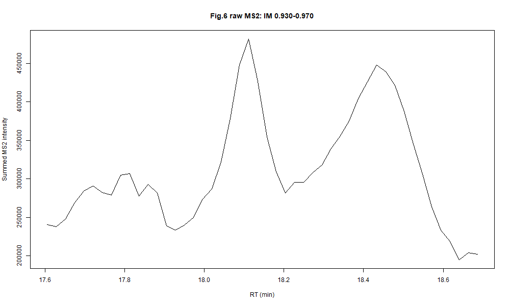

# TIMS / diaPASEF demo for MS2DecR

Bruker diaPASEF生データから、diaTracer論文Fig.6のリン酸化ペプチド位置異性体（S1/S8）を含む領域を切り出したデモです。**同梱データはBruker DLLを使用して生データから再生成し、2026-09-08に検証しました。**

## 内容

| パス | 内容 |
|---|---|
| [SOURCE_DATA.md](SOURCE_DATA.md) | 生データの元のURL、対象run、論文 |
| [GENERATION_ja.md](GENERATION_ja.md) | 抽出条件、処理の詳細、再生成方法 |
| [PROVENANCE.md](PROVENANCE.md) | 使用環境、DLLの出所・SHA-256、検証結果 |
| [scripts/extract_fig6_3d_cube_opentimsr.R](scripts/extract_fig6_3d_cube_opentimsr.R) | 生データからRT × IM × m/zを抽出 |
| [scripts/build_demo.R](scripts/build_demo.R) | IM積算による2次元RDS生成、検証、確認図、TSV圧縮 |
| [output/](output/) | 抽出済みデータ、RDS、確認図、検証表 |
| [SHA256SUMS](SHA256SUMS) | 同梱ファイルのSHA-256 |

生データ本体とDLLは同梱しません。抽出済みデータを利用するだけなら、どちらも不要です。

## デモを読む

以下のコマンドは **このフォルダ（data/tims）** をカレントディレクトリにして実行します。

```r
demo <- readRDS("output/fig6_ms2decr_demo_rt_mz.rds")
dim(demo$Y)          # 48 frames x 36488 m/z bins
length(demo$rt)      # 48; 秒
length(demo$mz)      # 36488; m/zビンの下端
plot(demo$rt / 60, rowSums(demo$Y), type = "l",
     xlab = "RT (min)", ylab = "Summed MS2 intensity")
# 既存MS2DecRのdeconvICA()へ渡す入力候補はdemo$Yです。
# 分離条件の最適化・分離性能の検証は、このデータ生成には含めません。
```

3次元データは圧縮TSVのlong tableです。R標準機能で読み込めます。

```r
con <- gzfile("output/both_deconv_cube_binned.tsv.gz", "rt")
cube <- read.delim(con)
close(con)
head(cube)
```



## 生データから再生成

[PRIDEの60min.zip](https://ftp.pride.ebi.ac.uk/pride/data/archive/2022/10/PXD033904/60min.zip)を取得・展開し、[対象run](SOURCE_DATA.md)の.dフォルダを指定します。

MS-DIAL 5.5の配布物 `MSDIAL.console.v5.5.260319-windows-net48` に含まれる `lib/Bruker/timsdata.dll` を使用しました。利用者がDLLを用意し、その場所を環境変数で指定します。Rには `opentimsr` と `data.table` が必要です。

```powershell
# data/tims をカレントディレクトリにして実行
$env:FIG6_D_PATH = './raw/fig6_run.d'  # 展開した対象runの.dに変更
$env:BRUKER_TIMSDATA_DLL = './lib/Bruker/timsdata.dll'
$env:FIG6_CUBE_OUT_DIR = './regenerated'
Remove-Item Env:FIG6_CUBE_WINDOW -ErrorAction SilentlyContinue
Rscript scripts/extract_fig6_3d_cube_opentimsr.R
if ($LASTEXITCODE -ne 0) { throw 'Extraction failed' }
Rscript scripts/build_demo.R
if ($LASTEXITCODE -ne 0) { throw 'Demo generation failed' }
```

設定済みのFIG6関連環境変数がある場合は、[既定値](GENERATION_ja.md)と一致することを確認してください。生データ・DLLの個人環境の絶対パスをGitに追加する必要はありません。

## 既存のデモとの関係

既存の [diapasef_phospho_fig6.rda](../diapasef_phospho_fig6.rda) と [選択フラグメントの解析例](../../dev/diapasef_best_methods_package/README.md) は別の入力・解析経路です。このフォルダのデータはフラグメントを事前選択せず、指定したm/z範囲の正の信号を保持しています。
