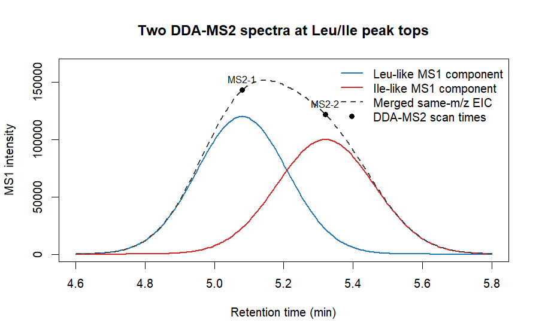
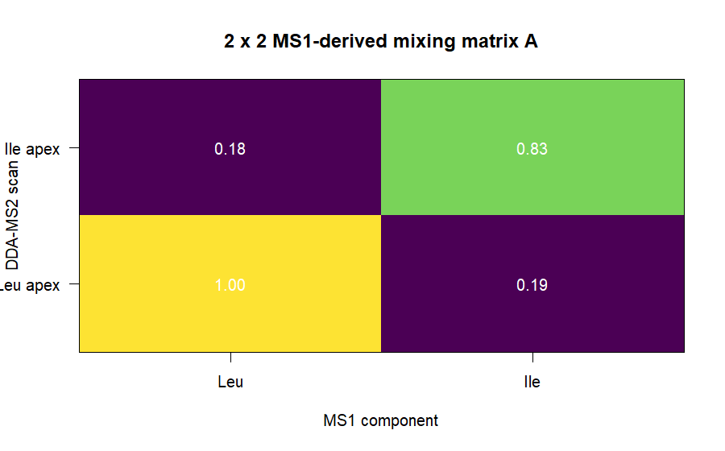
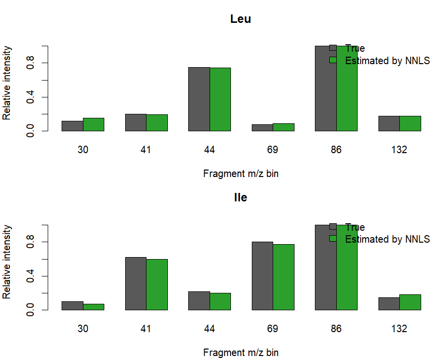
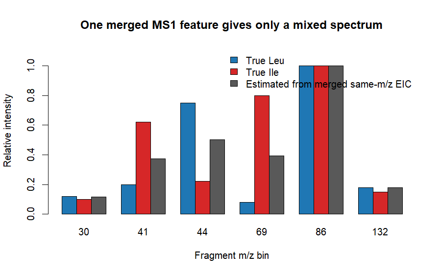

# MS1ガウスピーク分解を使ったDDA-MS2スペクトルアンミキシング

このフォルダは、ロイシン/イソロイシンのような異性体をイメージしたtoy simulationです。

ここで確認したいのは、**DDA-MS2スペクトルが2本だけある場合**です。

```text
MS2-1: Leu-likeピークトップ付近で取得
MS2-2: Ile-likeピークトップ付近で取得
```

この2本のMS2が、それぞれ少しchimericであるとします。

目的は、MS1クロマトグラムから推定した混合比を使って、2本のchimeric MS2からLeu/IleそれぞれのMS2スペクトルを復元できるかを見ることです。

これはMCR-ALSではありません。  
`A` をMS1から固定して、`Y = A S` を解く単純な線形アンミキシングです。

## コンセプト

ロイシンとイソロイシンのような異性体では、precursor m/zが同じになります。

そのため、MS1では同じm/zのEICとして観測されます。

```text
EIC_total(t) = Leu(t) + Ile(t)
```

もしLC上で2つのピークが少しずれていれば、この合計EICを2本のガウス関数で近似します。

```text
EIC_total(t) ~= G_Leu(t) + G_Ile(t)
```

そして、2本のDDA-MS2が取得された時刻で、それぞれのガウス関数の高さを読みます。

```text
A[j, Leu] = G_Leu(t_j)
A[j, Ile] = G_Ile(t_j)
```

例えば、以下のような混合行列になります。

```text
             Leu       Ile
MS2-1        high      low
MS2-2        low       high
```

観測されたDDA-MS2スペクトルを `Y` とすると、

```text
Y ~= A S
```

です。

ここで、

- `Y`: 観測された2本のchimeric DDA-MS2スペクトル
- `A`: MS1ガウスピーク分解から得た2 x 2混合行列
- `S`: 推定したいLeu/IleそれぞれのMS2スペクトル

です。

2成分・2スペクトルなので、理想的には逆行列で解けます。

```text
S = A^{-1} Y
```

実データではノイズや負値の問題があるため、このスクリプトでは逆行列に加えて、非負制約付き最小二乗も計算します。

```text
min ||Y - A S||^2
subject to S >= 0
```

## ファイル構成

```text
simulate_leu_ile_unmixing.R
README.md
figures/
output/
```

`figures/` にはREADME表示用の図を入れています。  
`output/` にはRスクリプトで実際に生成したCSV、PNG、summaryを入れています。

## 必要な環境

base Rのみで動きます。

CRANパッケージは不要です。

## 実行方法

このフォルダ内で実行する場合:

```bash
Rscript simulate_leu_ile_unmixing.R
```

親フォルダから実行する場合:

```bash
Rscript ms1_gaussian_dda_unmixing_r/simulate_leu_ile_unmixing.R
```

出力は以下に保存されます。

```text
ms1_gaussian_dda_unmixing_r/output/
```

## シミュレーション設定

同じprecursor m/zを持つ2つのMS1成分を作ります。

```text
Leu-like apex: 5.08 min
Ile-like apex: 5.32 min
```

DDA-MS2は2本だけです。

```text
MS2-1: 5.08 min
MS2-2: 5.32 min
```

各DDA-MS2スペクトルは、以下の式で生成します。

```text
Y_j = G_Leu(t_j) S_Leu + G_Ile(t_j) S_Ile + noise
```

toy fragment m/zは以下です。

```text
30, 41, 44, 69, 86, 132
```

toy spectrumは説明用に単純化しています。

```text
Leu-like: 44と86が強い
Ile-like: 41, 69, 86が強い
```

これらは実際のLeu/Ileライブラリスペクトルではありません。

## 出力ファイル

Rスクリプトを実行すると、以下のCSVとsummaryが出力されます。

```text
output/ms1_eic.csv
output/design_matrix_A.csv
output/observed_chimeric_ms2.csv
output/estimated_spectra.csv
output/summary.txt
```

また、以下の図が出力されます。

```text
output/01_ms1_eic_and_dda_times.png
output/02_design_matrix_A.png
output/03_true_vs_estimated_spectra.png
output/04_wrong_merged_feature.png
```

## 図

### 01_ms1_eic_and_dda_times.png

2本のMS1ガウスピーク、合計EIC、2本のDDA-MS2取得時刻を示します。



### 02_design_matrix_A.png

MS1ガウスピークから作った2 x 2混合行列 `A` を示します。



### 03_true_vs_estimated_spectra.png

真のtoy spectrumと、NNLSで推定したspectrumを比較します。



### 04_wrong_merged_feature.png

対照計算です。

MS1でLeu/Ileを分けず、1本のsame-m/z EICとして扱った場合、Leu/Ile別々のスペクトルは得られず、混合スペクトルだけになります。



## シミュレーション結果

R版の実行結果では、DDA-MS2スキャン数は2本です。

```text
DDA-MS2 scan count: 2
Condition number of A: 1.612
Correlation true vs inverse Leu: 0.9994
Correlation true vs inverse Ile: 0.9980
Correlation true vs NNLS Leu: 0.9994
Correlation true vs NNLS Ile: 0.9980
```

混合行列 `A` は以下のようになります。

```text
                    Leu       Ile
Leu_apex_scan 120000.00  23006.63
Ile_apex_scan  21831.41 100000.00
```

これは、1本目のMS2はLeu-like成分が優勢、2本目のMS2はIle-like成分が優勢であることを意味します。

推定スペクトルの例です。

```text
fragment m/z   true Leu   NNLS Leu   true Ile   NNLS Ile
30             0.120      0.153      0.100      0.074
41             0.200      0.193      0.620      0.596
44             0.750      0.744      0.220      0.202
69             0.080      0.090      0.800      0.771
86             1.000      1.000      1.000      1.000
132            0.180      0.177      0.150      0.184
```

一方、MS1を1本のmerged EICとして扱うと、分離はできません。

```text
fragment m/z   merged estimate
30             0.117
41             0.374
44             0.501
69             0.395
86             1.000
132            0.180
```

## 解釈

このシミュレーションが示していることは単純です。

```text
Leu優勢のDDA-MS2が1本
Ile優勢のDDA-MS2が1本
MS1からその混合比を推定できる
```

この条件がそろえば、2本のchimeric MS2から、Leu/IleそれぞれのMS2スペクトルを線形アンミキシングで推定できます。

ただし、これはALSではありません。

重要なのは、

```text
MS1ガウスピーク分解から、信頼できる2 x 2混合行列Aを作れるか
```

です。

2本のDDA-MS2がほぼ同じ混合比で取得されている場合、`A` のcondition numberが悪化し、分解は不安定になります。

また、異性体が完全共溶出し、MS1由来の混合比が変わらない場合、この方法では分離できません。
